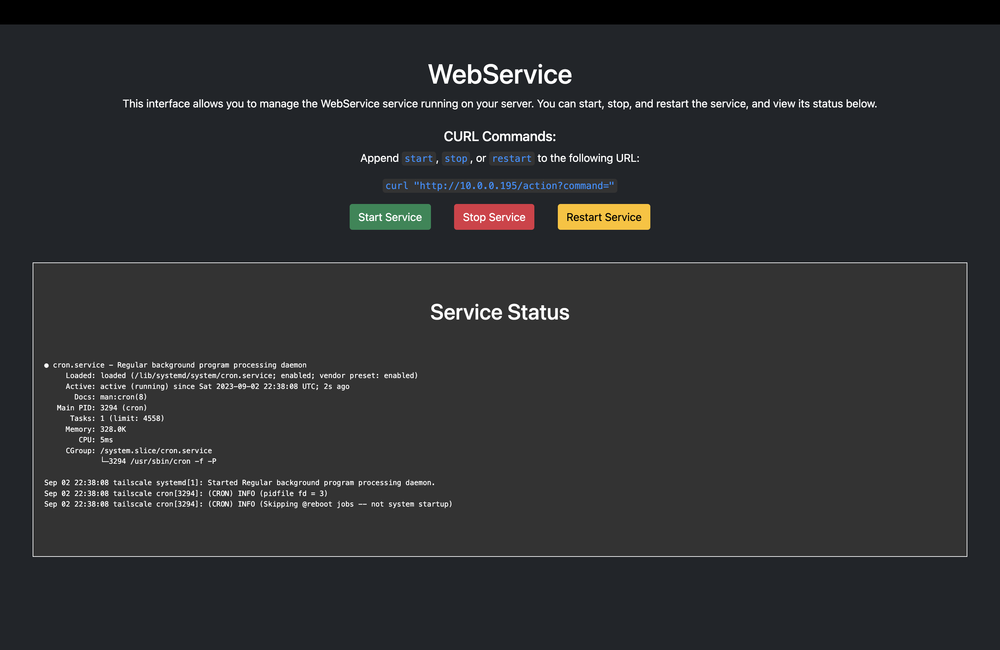

# WebService :computer:

 

## Table of Contents
1. [Introduction](#introduction)
2. [Installation](#installation)
3. [Configuration](#configuration)
4. [Usage](#usage)
5. [API](#api)
6. [Contributing](#contributing)
7. [Troubleshooting](#troubleshooting)
8. [License](#license)

## Introduction

WebService is a web-based interface built with Flask for managing a Linux service. Start, stop, restart, and view the status of your chosen service remotely through a user-friendly dashboard.

## Installation

### Clone the Repository

```bash
git clone https://github.com/rusjp/WebService.git
```

### Navigate to the Project Directory

```bash
cd WebService
```

### Install Required Packages

Ensure you have Python 3.x installed, and then run:

```bash
pip install -r requirements.txt
```

## Configuration

Edit the `config.json` file to customize the service and Flask app settings.

```json
{
    "START_COMMAND_STR": "sudo systemctl start your_service_name.service",
    "STOP_COMMAND_STR": "sudo systemctl stop your_service_name.service",
    "RESTART_COMMAND_STR": "sudo systemctl restart your_service_name.service",
    "STATUS_COMMAND_STR": "sudo systemctl status your_service_name.service",
    "APP_TITLE": "Your Custom Title",
    "FLASK_HOST": "0.0.0.0",
    "FLASK_PORT": 80,
    "FLASK_DEBUG": false
}
```

Replace `your_service_name` and `Your Custom Title` with appropriate values.

## Usage

1. **Start the Flask Application**

```bash
python web_ui.py
```

2. **Open the Dashboard**
   The web interface should now be available at `http://0.0.0.0:80/`.



3. **Control Your Service**
   Use the Start, Stop, and Restart buttons to control your chosen Linux service.

## API

To control the service using curl, the API exposes an `/action` route to which you can send GET or POST requests.

To start the service:

```bash
curl -X POST http://x.x.x.x:80/action -d '{"command": "start"}' -H "Content-Type: application/json"
```

To stop the service:

```bash
curl -X POST http://x.x.x.x:80/action -d '{"command": "stop"}' -H "Content-Type: application/json"
```

To restart the service:

```bash
curl -X POST http://x.x.x.x:80/action -d '{"command": "restart"}' -H "Content-Type: application/json"
```

## Running the Curl Commmand
```bash
curl -X POST http://x.x.x.x:80/action -d '{"command": "start"}' -H "Content-Type: application/json"
```
## Example JSON Reply
```bash
{"status":"\u25cf cron.service - Regular background program processing daemon\n     Loaded: loaded (/lib/systemd/system/cron.service; enabled; vendor preset: enabled)\n     Active: active (running) since Sat 2023-00-00 00:00:00 UTC; 14min ago\n       Docs: man:cron(8)\n   Main PID: 3294 (cron)\n      Tasks: 1 (limit: 4558)\n     Memory: 328.0K\n        CPU: 3ms\n     CGroup: /system.slice/cron.service\n             \u2514\u25003294 /usr/sbin/cron -f -P\n\nSep 02 22:38:08 tailscale systemd[1]: Started Regular background program processing daemon cron[3294]: (CRON) INFO (pidfile fd = 3)\cron[3294]: (CRON) INFO (Skipping @reboot jobs -- not system startup)\n"}
```
## Contributing

Contributions are welcome! Feel free to open an issue or submit a pull request.

## Troubleshooting

If you encounter issues running the project, consider the following steps:

- Update Flask and its dependencies using `pip install --upgrade Flask`.
- Reinstall `itsdangerous` with `pip uninstall itsdangerous` and `pip install itsdangerous`.
- Make sure to activate the virtual environment if you're using one.
- Check for multiple Python installations using `which python3` and use the full path to run the script if necessary.

## License

This project is licensed under the MIT License. See the [LICENSE](LICENSE) file for details.
